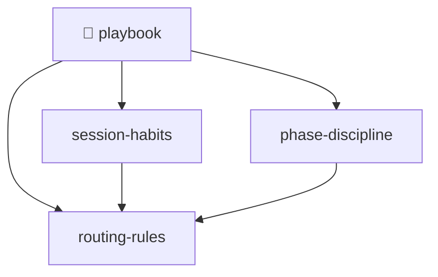

# 📔 Playbook — map of content

🟢 **active**

The working rules the starter-pack skills assume. Three notes, each pointing at the skill that owns
it. Edit them — they are your rules now, not a fixed spec.

> [!info] Where these came from
> The starter pack installed them. Delete any note you disagree with; nothing reads this folder
> automatically, so the only cost of keeping it is a few nodes in your graph.

## Notes
- [[session-habits]] — search before guessing, consolidate on a rhythm, publish before done
- [[phase-discipline]] — one phase at a time, tests every phase, reflect before replanning
- [[routing-rules]] — which skill to load first for prose and for UI

## Related
- [[_Home]]
- [[how-memory-works]]
