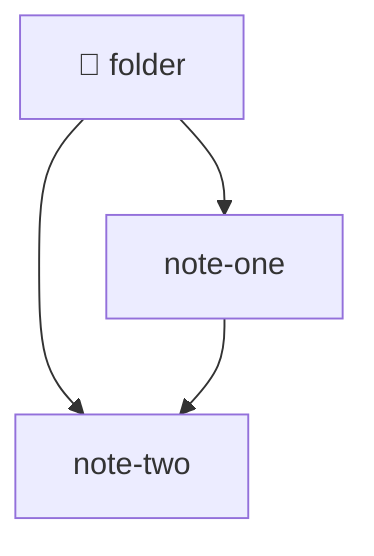

# 📁 Folder — map of content

🟢 **active**

What this folder holds, in one sentence.

> [!info] Current status
> Where this project stands right now. Update this line, do not append to it.

## Notes

One line per note in this folder, each a wikilink to it plus a short hook:

- note-one — one-line hook
- note-two — one-line hook

## Related
- [[_Home]]
