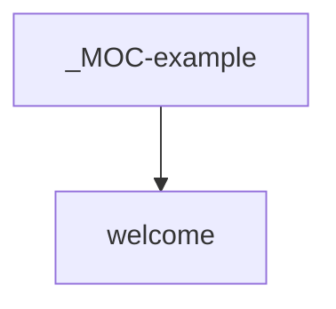

# Example — Map of Content

Hub note for a folder. Each project folder gets one `_MOC-<folder>`.

```mermaid
graph TD
  MOC["_MOC-example"] --> welcome["welcome"]
```

## Notes
- [[welcome]] — how a note is shaped 🟢

## Related MOCs
- [[_Home]]
